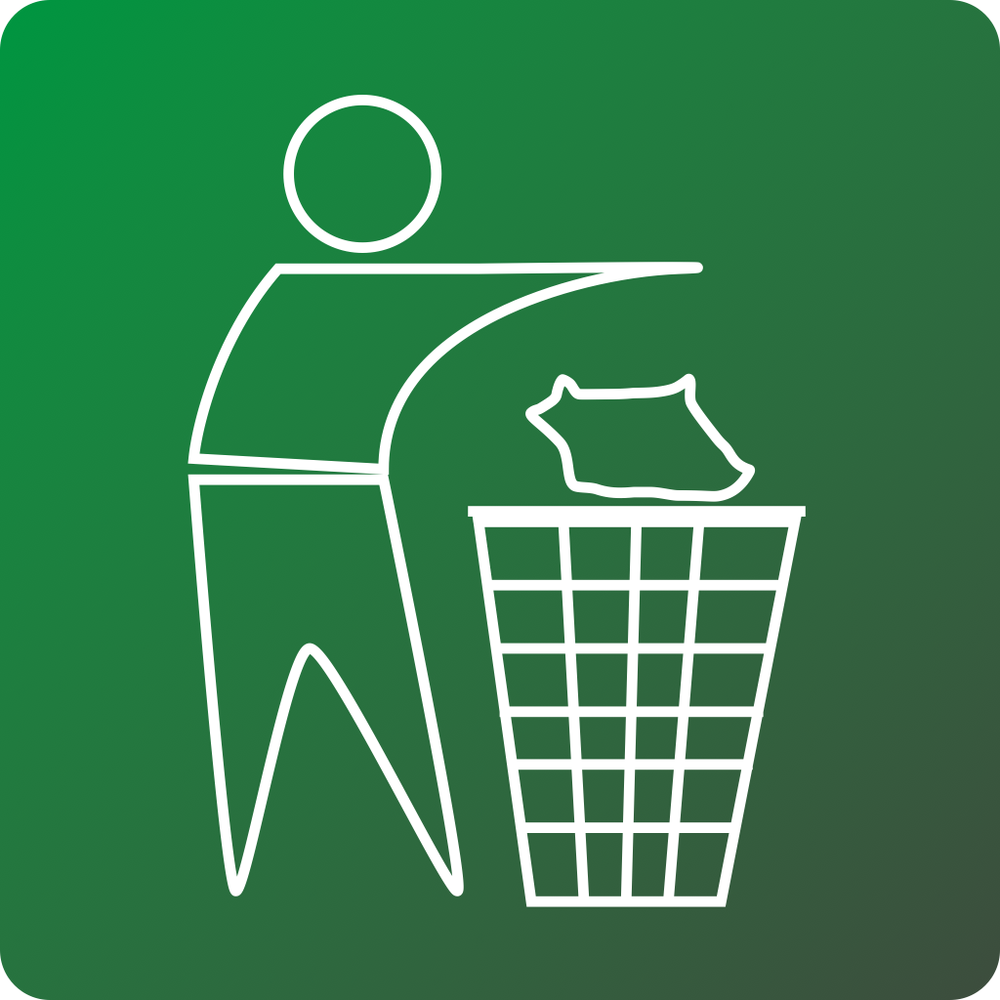

# Clean Up - Give Back

**Turn neighborhood cleanups into trusted service hours — with GPS, photo checkpoints, and an admin who can actually verify the work.**

Sample nonprofit app · Volunteer programs · Events · Donate · Store

  
  
  
  
  

  
  
  
  

---

## TL;DR

**Clean Up - Give Back** is a nonprofit cleanup program with a mobile app that makes volunteering *provable*.

Volunteers walk a route, take timed selfie + progress photos, and submit a session. The organization gets a walking path, checkpoints, and hours they can approve — including for court-ordered and school service — instead of trusting a handwritten timesheet.

This repo is the product monorepo: **Expo mobile app**, **Next.js admin console**, and **session backend**.

| Who | What they get |
|-----|----------------|
| **Volunteers** | Start a cleanup, track miles/time on a live map, hit photo checkpoints, download a service letter when approved |
| **Admins** | Review sessions with route + photos, approve or decline, manage users/orders/events, email volunteers |
| **The mission** | More cleanups done, more hours that stand up to scrutiny, less paperwork friction |

---

## Why this matters

Most “log your volunteer hours” tools stop at a form. Cleanup hours — especially court-ordered ones — need **evidence**:

1. **Were you there?** → GPS route while the session is live  
2. **Were you working?** → Timed checkpoint photos (selfie + progress)  
3. **Can staff trust it?** → Admin review with maps, photos, notes, and an audit trail  
4. **Can the volunteer prove it?** → Approved sessions → downloadable service / court letter  

That’s the interesting part of this project: it’s not only a lifestyle volunteer app. It’s **field operations + verification** for a real 501(c)(3) — built so community service is easier to *do* and harder to *fake*.

---

## What ships in this monorepo

| | Path | Purpose |
|:--:|------|---------|
| 📱 | [`frontend/`](frontend/) | Expo React Native app (volunteers): sessions, map, shop, events, account |
| 🖥️ | [`admin-web-app/`](admin-web-app/) | Next.js admin console |
| ⚙️ | [`backend/`](backend/) | Sessions API (create / checkpoints / finalize / PDFs) |
| 🗄️ | [`admin/`](admin/) | **Archived** legacy admin — keep `admin/db/*.sql` for Supabase migrations |
| 📚 | [`docs/`](docs/) | Living docs, specs, ADRs, agent context |
| 🧩 | [`.cursor/`](.cursor/) | Cursor IDE rules and hooks |

**Product surfaces (high level)**

- **Mobile** — onboarding, home dashboard, live tracker (minimize and keep going), sessions list/detail, events, shop/cart, privacy & feedback, Account **Updates** (What’s New)  
- **Admin** — sessions moderation, volunteers/users, orders, payments, events, emails, US activity map, service letters / court packets  
- **Data** — Supabase Auth + Postgres; sessions API; Resend for transactional email  

For “what runs today,” start at [docs/current.md](docs/current.md).

---

## Explore the sample

| Doc | Purpose |
|-----|---------|
| **[docs/start-here.md](docs/start-here.md)** | Five-minute walkthrough — mobile, admin, API, and how they connect |
| [docs/architecture.md](docs/architecture.md) | Mermaid system diagrams |
| [ARCHITECTURE.md](ARCHITECTURE.md) | Short link hub |
| [docs/screens/README.md](docs/screens/README.md) | Every screen and admin page → source file |
| [docs/SAMPLE_DATA.md](docs/SAMPLE_DATA.md) | Mocks, placeholders, and what would be live |
| [SECURITY.md](SECURITY.md) | No secrets policy |
| [CONTRIBUTING.md](CONTRIBUTING.md) | PR expectations |

---

## Viewing this sample

This repository is **source only**. It is not wired to a backend, Apple team, or EAS project, and it is not set up to install or run on a phone.

Browse [`frontend/`](frontend/), [`admin-web-app/`](admin-web-app/), and [`backend/`](backend/) in the editor. Do not run `npm start`, Expo Go, or EAS/TestFlight from this copy.

### Frontend layout (cheat sheet)

- `frontend/src/app/` — Expo Router screens  
- `frontend/src/components/` — shared UI  
- `frontend/src/features/` — session tracking, shop, onboarding, etc.  
- `frontend/assets/` — images, fonts, branding  
- `frontend/design/` — design workspace (HTML prototypes, tokens)  

---

## Documentation

| Start here | |
|------------|--|
| [docs/start-here.md](docs/start-here.md) | Product walkthrough (mobile + admin + API) |
| [docs/screens/README.md](docs/screens/README.md) | Screen and page index |
| [docs/README.md](docs/README.md) | Full docs index |
| [docs/current.md](docs/current.md) | Capability snapshot |
| [docs/architecture.md](docs/architecture.md) | System diagrams |
| [docs/progress.md](docs/progress.md) | Build log (omitted from this sample) |

Brand: forest green `#009540`, Sanchez + Noto Sans — see [docs/frontend/brand.md](docs/frontend/brand.md).

---

## License

See [LICENSE](LICENSE). Operator identity and production credentials are not included in this sample.
