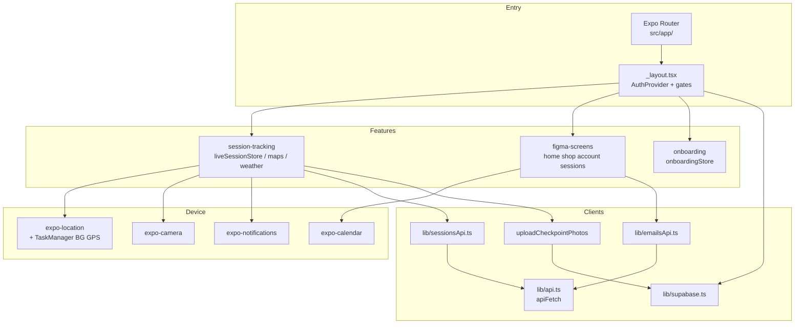
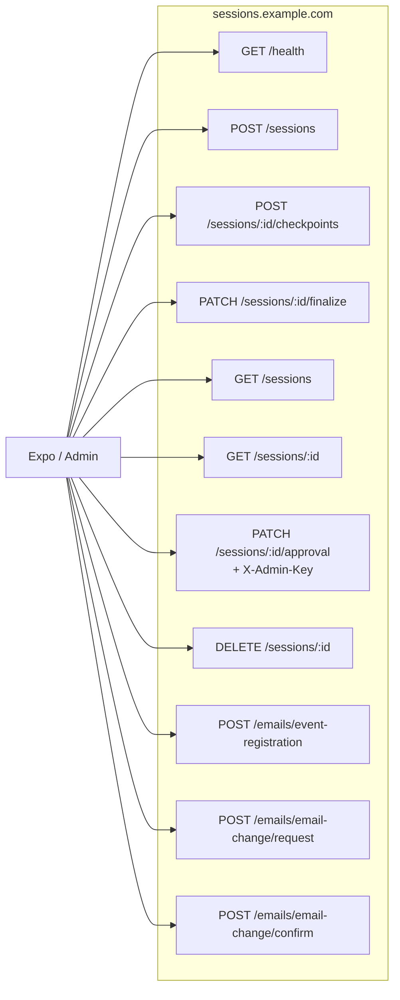
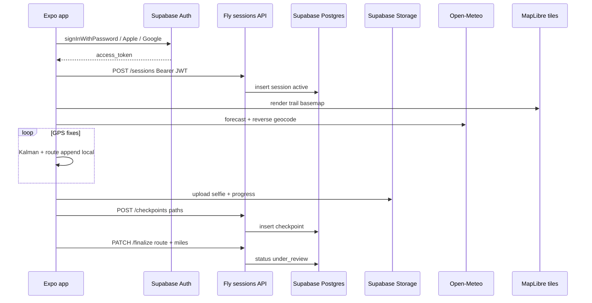
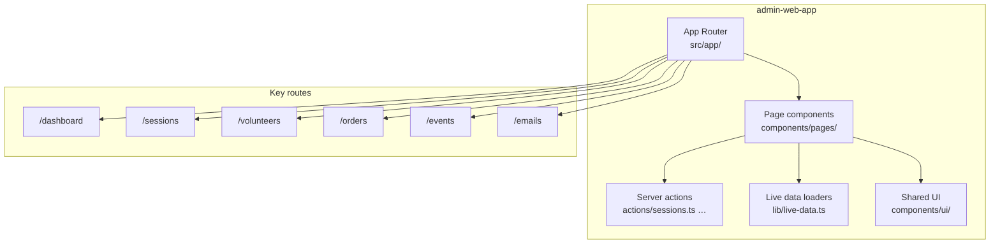
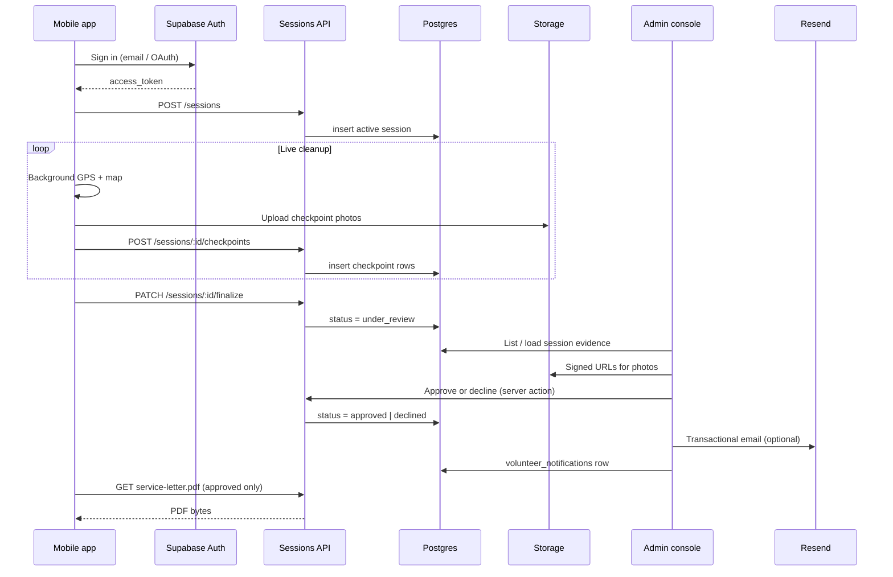

# System architecture

Mermaid overview of the Clean Up - Give Back monorepo: Expo app, Fly sessions API, Supabase, admin portal, client-only integrations, and deferred scaffolds.

**Scope:** There is one backend HTTP service (`backend/sessions`). Maps and weather are client-side. `backend/maps` is a scaffold only. The production admin console is [`admin-web-app/`](../admin-web-app/) (Next.js App Router). Legacy [`admin/`](../admin/) is archived — SQL migrations only.

**Start here:** [start-here.md](start-here.md) · **Screens:** [screens/README.md](screens/README.md) · **Mocks:** [SAMPLE_DATA.md](SAMPLE_DATA.md)

Related: [current.md](current.md), [supabase.md](supabase.md), [admin-web-app.md](admin-web-app.md), [backend/specs/sessions-api.md](backend/specs/sessions-api.md), [adr/ADR-004-sessions-backend-supabase-fly.md](adr/ADR-004-sessions-backend-supabase-fly.md), [adr/overview.md](adr/overview.md).

---

## Legend

| Style | Meaning |
|-------|---------|
| Solid edges | Live integration in production / test phase |
| Dotted edges | Optional, UI-only, or not fully wired |
| Deferred / scaffold | Directory or product surface exists; no runtime backend yet |

| Layer | Reality |
|-------|---------|
| Backend runtime | One service: Fastify in [`backend/sessions/`](../backend/sessions/) |
| Auth | Supabase volunteer JWT (email / Apple / Google); API verifies via JWKS |
| Photos | Client → Storage; API stores paths only |
| Maps / weather | No backend; MapLibre + Carto/Esri + Open-Meteo |
| Payments | Stripe Checkout on [`backend/sessions/`](../backend/sessions/) (`/payments/*`, `/webhooks/stripe`); tracker mock |
| Email | Resend live (`example.org` verified); admin local + Fly secrets |
| Shipping | Shippo labels from Fly (`/shipping/*`, `/webhooks/shippo`); admin Buy label |
| Env | `EXPO_PUBLIC_API_URL`, `EXPO_PUBLIC_SUPABASE_*`; Fly: `DATABASE_URL`, `SUPABASE_URL`, `SUPABASE_JWT_SECRET`, `RESEND_API_KEY`, `EMAIL_FROM`, `ADMIN_NOTIFY_EMAIL` (+ optional `ADMIN_API_KEY` / service role) |

---

## 1. System context (all integrations)

```mermaid
flowchart TB
  subgraph clients [Clients]
    Expo["Expo app\nfrontend/"]
    Admin["Admin console\nadmin-web-app/"]
  end

  subgraph fly [Fly.io example-sessions :8080]
    API["Fastify + Prisma\nbackend/sessions"]
  end

  subgraph supabase [Supabase]
    Auth["Auth\nvolunteer JWT"]
    PG[("Postgres\nsessions / checkpoints")]
    Store[("Storage\nsession-photos")]
    JWKS["JWKS\nES256 verify"]
  end

  subgraph clientOnly [Client-only SaaS / CDNs]
    OpenMeteo["Open-Meteo\nweather + reverse geocode"]
    Carto["Carto basemaps\nVoyager / Dark Matter"]
    Esri["Esri ArcGIS tiles\nsatellite / hybrid"]
    MapLibreCDN["unpkg MapLibre GL JS\nExpo Go WebView"]
    ExtMaps["Apple / Google Maps\ndeep links"]
  end

  subgraph external [Server integrations]
    Resend["Resend\ntransactional email"]
    Stripe["Stripe Checkout"]
    Shippo["Shippo USPS labels"]
  end

  subgraph deferred [Deferred / scaffold]
    MapsSvc["backend/maps/\nno runtime"]
    PaySvc["backend/sessions/payments\nStripe Checkout"]
    StripeUI["Shop/Donate UI\nhosted Checkout"]
  end

  Expo -->|"Bearer JWT"| API
  Expo --> Auth
  Expo -->|"upload + signed URLs"| Store
  Expo --> OpenMeteo
  Expo --> Carto
  Expo --> Esri
  Expo --> MapLibreCDN
  Expo --> ExtMaps
  Expo -->|"Bearer JWT checkout"| PaySvc
  Expo -.-> StripeUI

  Admin -->|"service role / table access"| PG
  Admin -->|"signed photo URLs"| Store
  Admin -.->|"optional X-Admin-Key"| API

  API --> JWKS
  API --> PG
  API --> Resend
  API --> Stripe
  API --> Shippo
```

---

## 2. Frontend internal structure

---

## 3. Sessions API surface

Base URL (prod): `https://sessions.example.com`. Auth: `Authorization: Bearer <supabase_access_token>` except `GET /health`.

Full contract: [backend/specs/sessions-api.md](backend/specs/sessions-api.md).

---

## 4. Live session data flow

GPS is client-owned mid-session; the finalized polyline is persisted on `PATCH /sessions/:id/finalize`.

---

## 5. Admin console internal structure

Production admin lives in [`admin-web-app/`](../admin-web-app/). Pages under `src/app/` compose UI from `src/components/pages/` and server actions in `src/actions/`.

Session moderation detail: preview drawer loads route polyline + signed checkpoint photos; approve/decline writes Postgres, audit log, volunteer notification, and optional email. See [admin-web-app.md](admin-web-app.md).

---

## 6. End-to-end approval flow (mobile + admin + API)

How a volunteer session moves from field capture to an approvable record and service letter.

Volunteer-facing status and PDF download: [`SessionDetailScreen.tsx`](../frontend/src/features/figma-screens/screens/SessionDetailScreen.tsx). Admin session UI: [`SessionsPage.tsx`](../admin-web-app/src/components/pages/SessionsPage.tsx) + [`SessionPreviewDrawer.tsx`](../admin-web-app/src/components/ui/SessionPreviewDrawer.tsx).
