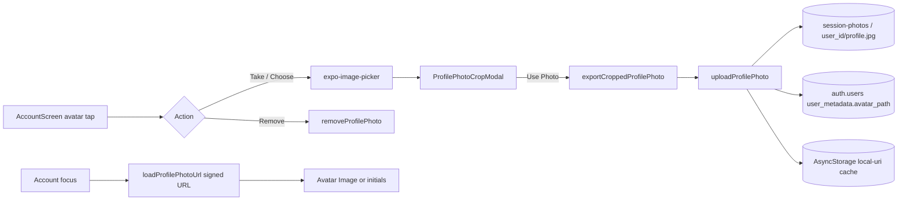

# Spec: Account profile photo

**Status:** Shipped (2026-08-18)  
**Route:** `/account` (`AccountScreen`)  
**Related:** [session-tracking-expo-go.md](./session-tracking-expo-go.md) (Storage bucket `session-photos`), [supabase.md](../../supabase.md) §4

---

## Summary

Volunteers can set a circular profile photo on the Account tab. Tapping the avatar opens **Take Photo**, **Choose from Library**, or **Remove Photo**. New picks open a full-screen crop editor with free pan/pinch and **Fill** / **Crop** presets before upload. The image is stored in Supabase Storage and referenced from Auth `user_metadata.avatar_path`. A role pill under the display name shows **Court Ordered** (amber) or **Volunteer** (green) from onboarding / Supabase `service_type`.

---

## User stories

- As a volunteer, I want to add a photo of myself on Account, so Admin and I can recognize my profile.
- As a volunteer, I want to reposition and zoom my photo before saving, so my face is framed correctly in the circle.
- As a volunteer, I want to remove my profile photo and fall back to initials.
- As a court-ordered volunteer, I want my Account profile to show that status clearly under my name.

---

## Acceptance criteria

- [x] **AC-1:** Account profile hero avatar is tappable; action sheet offers Take Photo, Choose from Library, Remove Photo (when a photo exists), and Cancel.
- [x] **AC-2:** Camera and photo-library picks use `expo-image-picker` with `allowsEditing: false` (full-resolution source) and open `ProfilePhotoCropModal` before upload.
- [x] **AC-3:** Crop modal supports simultaneous pan and pinch; user can zoom out beyond cover (min scale ≈ 65% of contain scale).
- [x] **AC-4:** Crop modal presets: **Fill** (cover, centered), **Crop** (cover × 1.08, centered — tighter profile framing). **Fit** (contain) was removed per product request.
- [x] **AC-5:** Crop modal top bar white background extends to the physical top of the screen; safe-area inset applies inside the bar (title/actions below notch), matching other app bars.
- [x] **AC-6:** **Use Photo** exports a 512×512 JPEG via `expo-image-manipulator` (`cropProfilePhoto.ts`) and uploads via `profilePhoto.ts`.
- [x] **AC-7:** Upload path: `session-photos` bucket, `{user_id}/profile.jpg` (upsert). Metadata: `user_metadata.avatar_path` = same path string. Local AsyncStorage cache for immediate display when offline or before signed URL resolves.
- [x] **AC-8:** On Account focus, load signed URL from `avatar_path`; fallback to cached local URI; fallback to initials avatar when none.
- [x] **AC-9:** Remove Photo clears metadata and local cache; avatar returns to initials (Storage object may remain until next upload overwrites).
- [x] **AC-10:** Role pill under display name: **Court Ordered** when `service_type === 'Court Ordered'` (Supabase metadata or in-memory onboarding store); otherwise **Volunteer**. Colors: amber pending tokens vs green approved tokens.
- [x] **AC-11:** iOS/Android photo permission strings in `frontend/app.json` (`expo-image-picker` plugin + `NSPhotoLibraryUsageDescription`).

---

## Architecture

### Key files

| File | Role |
|------|------|
| `frontend/src/features/figma-screens/screens/AccountScreen.tsx` | Avatar UI, picker flow, role pill, upload orchestration |
| `frontend/src/features/figma-screens/components/ProfilePhotoCropModal.tsx` | Full-screen crop editor |
| `frontend/src/lib/cropProfilePhoto.ts` | Preset math, crop rect, JPEG export |
| `frontend/src/lib/profilePhoto.ts` | Upload, remove, signed URL load, AsyncStorage cache |
| `frontend/src/lib/signedStorageUrl.ts` | Short-lived signed URLs for `session-photos` |

### Dependencies

- `expo-image-picker` (~17, SDK 54)
- `expo-image-manipulator` (SDK 54)
- `react-native-gesture-handler` + `react-native-reanimated` (pan/pinch)
- Supabase anonymous auth + existing `session-photos` RLS (`{user_id}/…` prefix)

---

## Out of scope

- Admin console volunteer avatar display (admin may still use initials until wired separately).
- Gravatar / email inbox avatar (see [reports/2026-08-18-inbox-sender-logo-admin.md](../../reports/2026-08-18-inbox-sender-logo-admin.md)).
- Dedicated `profile-photos` bucket (reuses `session-photos` + RLS).
- Server-side image moderation.

---

## Test plan

1. **Account → avatar → Choose from Library** — crop modal opens; pan/pinch work; Fill and Crop snap framing; Use Photo returns to Account with photo visible.
2. **Take Photo** — camera permission prompt; same crop flow.
3. **Remove Photo** — initials return; pill and stats unchanged.
4. **Court Ordered onboarding** — amber **Court Ordered** pill; other service types show green **Volunteer**.
5. **Supabase configured** — verify object at `{user_id}/profile.jpg` and `avatar_path` in Auth user metadata after upload.
6. **Kill app / reopen Account** — photo reloads from signed URL (or cache if offline).
7. **Crop modal top bar** — white bar flush to top edge; no cream gap above header on notched devices.

---

## Decisions

| Decision | Rationale |
|----------|-----------|
| Reuse `session-photos` bucket | Existing RLS already scopes `{user_id}/…`; no new migration. |
| Custom crop UI vs native `allowsEditing` | Native iOS crop restricted pan/zoom; product needed free reposition + presets. |
| No **Fit** preset | Product removed contain preset; pinch-out still allows seeing more of the image. |
| Role pill defaults to **Volunteer** | Any non–court-ordered `service_type` (Volunteering, School, Other) shows Volunteer. |
