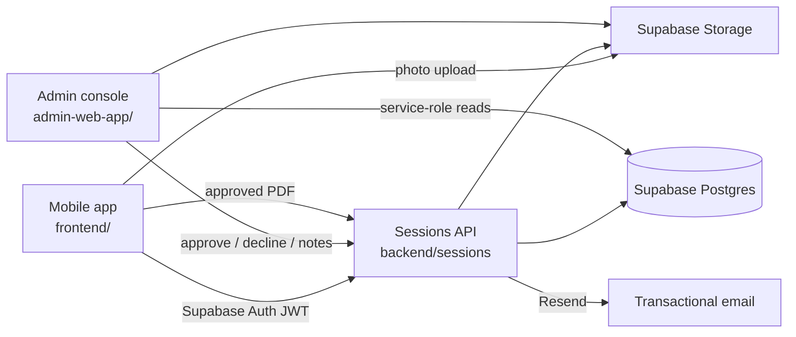
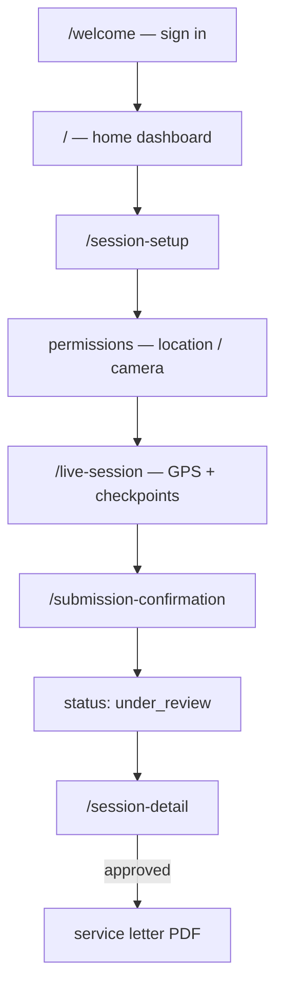
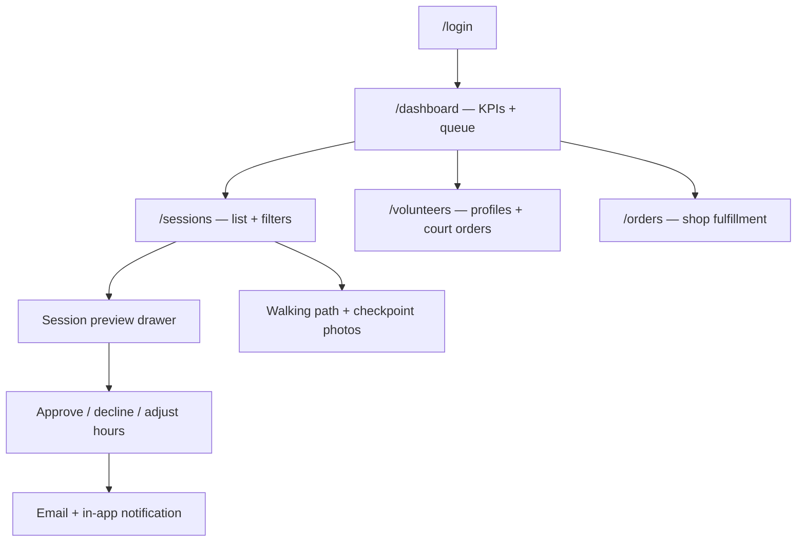
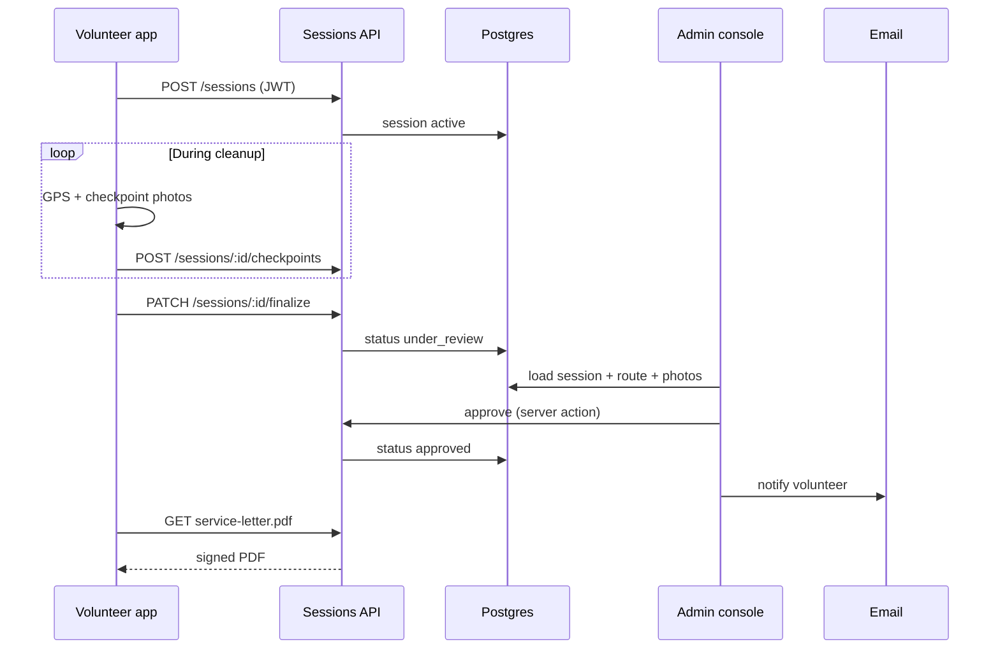

# Start here

Five-minute orientation for this **source-only sample** of Clean Up - Give Back. No backend, Apple team, or EAS project is wired up in this repo — browse code and docs in the editor.

---

## What this product is

A nonprofit volunteer app where cleanup hours are **provable**: GPS route, timed checkpoint photos, admin review, and downloadable service letters (including court-ordered service).

| Surface | Path | Role |
|---------|------|------|
| Mobile | [`frontend/`](../frontend/) | Volunteers track sessions, shop, events, account |
| Admin | [`admin-web-app/`](../admin-web-app/) | Staff review sessions, manage users/orders/events |
| API | [`backend/sessions/`](../backend/sessions/) | Session lifecycle, PDFs, payments, email |
| Migrations | [`admin/db/`](../admin/db/) | Supabase SQL (archived `admin/` app kept for schema only) |

---

## How the pieces connect

Full diagrams: [architecture.md](architecture.md).

---

## Suggested reading order

1. **[architecture.md](architecture.md)** — system context, mobile structure, API routes, live-session sequence, admin approval flow  
2. **[screens/README.md](screens/README.md)** — every mobile route and admin page → source file  
3. **[SAMPLE_DATA.md](SAMPLE_DATA.md)** — what is mocked vs what would hit production services  
4. **Flagship code (optional deep dive)**  
   - Mobile onboarding: [`frontend/src/screens/WelcomeScreen.tsx`](../frontend/src/screens/WelcomeScreen.tsx)  
   - Live tracking: [`frontend/src/screens/LiveSessionScreen.tsx`](../frontend/src/screens/LiveSessionScreen.tsx) + [`frontend/src/features/session-tracking/`](../frontend/src/features/session-tracking/)  
   - Session review: [`admin-web-app/src/components/pages/SessionsPage.tsx`](../admin-web-app/src/components/pages/SessionsPage.tsx)  
   - Service letter PDF: [`backend/sessions/src/routes/serviceLetter.ts`](../backend/sessions/src/routes/serviceLetter.ts)

---

## Mobile app (volunteer flow)

Routes live under [`frontend/src/app/`](../frontend/src/app/). Screen components are in [`frontend/src/screens/`](../frontend/src/screens/) and [`frontend/src/features/`](../frontend/src/features/).

Static HTML mockups for major flows: [`frontend/design/stitch_htmls/`](../frontend/design/stitch_htmls/) (open locally in a browser).

---

## Admin console (operator flow)

Pages: [`admin-web-app/src/app/`](../admin-web-app/src/app/). UI: [`admin-web-app/src/components/pages/`](../admin-web-app/src/components/pages/).

Feature narrative: [admin-web-app.md](admin-web-app.md).

---

## End-to-end: one session from field to letter

---

## What not to do in this copy

- Do not run `npm start`, Expo Go, EAS, or TestFlight — scripts are intentionally blocked.  
- Do not commit `.env` files or real API keys. See [SECURITY.md](../SECURITY.md).  
- Do not expect live data — mocks and placeholders are documented in [SAMPLE_DATA.md](SAMPLE_DATA.md).

---

## More docs

| Doc | Purpose |
|-----|---------|
| [README.md](../README.md) | Repo overview |
| [CONTRIBUTING.md](../CONTRIBUTING.md) | Expectations for forks and PRs |
| [docs/README.md](README.md) | Full documentation index |
| [current.md](current.md) | Product capability snapshot (sanitized) |
| [frontend/brand.md](frontend/brand.md) | Colors, fonts, tone |
